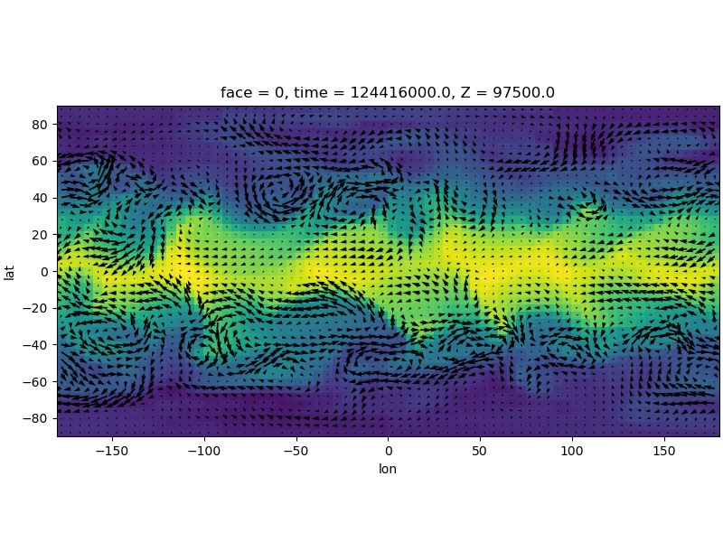
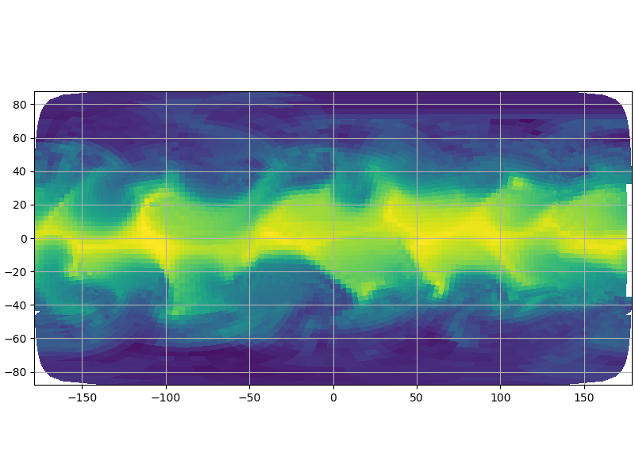
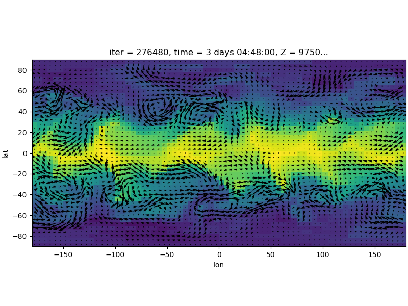

# cubedsphere
Library for post processing of MITgcm cubed sphere data

## Capabilities:
- regrid cubed sphere datasets using [`xESMF`](https://xesmf.readthedocs.io/en/latest/) and [`xgcm`](https://xgcm.readthedocs.io/en/latest/)
- open datasets created by the [`mnc`](https://mitgcm.readthedocs.io/en/latest/outp_pkgs/outp_pkgs.html#netcdf-i-o-pkg-mnc) package
- open datasets using `xmitgcm` (needs current PR [#98](https://github.com/MITgcm/xmitgcm/pull/98)) 
- plot original cubed sphere data
- some more small utilities
- more to come...

## Note:
Work in progress! This library is a collection of tools that I found useful to use for the interpretation of cubed sphere data.

## ToDo:
**Postprocessing**:
- [x] interface `xmitgcm` to enable the use of `.meta` and `.data` files *-> added wrapper*
- [ ] how do we expand lon_b and lat_b from left to outer for xmitgcm wrapper? 

**Testing**:
- [ ] compare results with matlab scripts

**Interface**:
- [x] which values should be hardcoded? *-> done in const.py*
- [ ] special tools needed for exorad?

## Installation:
**Clone this repo**:<br>
```shell
git clone https://github.com/AaronDavidSchneider/cubedsphere.git
cd cubedsphere
```
**Create conda environment:**<br>
```shell
conda create -n mitgcm
```

**Activate environment:**<br>
```shell
conda activate mitgcm
```

**Install dependencies**:<br>
```shell
conda install -c conda-forge xesmf esmpy xgcm matplotlib
```

**Install `cubedsphere`**:<br>
```shell
pip install -e .
```

You can now import the `cubedsphere` package from everywhere on your system 
## Example Usage
See `examples/example.py`. The following plots have been created using data from `tutorial_held_suarez_cs`.
```python
import matplotlib.pyplot as plt
import cubedsphere as cs
import time

# Specify directory where the output files can be found
outdir = "run"

# open Dataset
ds = cs.open_mnc_dataset(outdir, 276480)

# regrid dataset
t = time.time()
regridder = cs.Regridder(ds, 5, 4, reuse_weights=False, filename="weights")
# Note: once weights were created, we can also reuse files by using reuse_weights=True (saves time).
ds_reg = regridder.regrid()
print(f"time needed to regrid dataset: {time.time()-t}")
```
Only takes 3 seconds!
```python
# do some basic plotting to demonstrate the dataset
# determine which timestep and Z to use:
isel_dict = {"T":1,"Zmd000020":0}

# do some basic plotting to demonstrate the dataset
ds_reg["THETA"].isel(**isel_dict).plot()
U, V = ds_reg["UVEL"].isel(**isel_dict).values, ds_reg["VVEL"].isel(**isel_dict).values
cs.overplot_wind(ds_reg, U, V)
plt.show()
```

```python
# Now also plotting theta without regridding (on the original grid):
cs.plotCS(ds["THETA"].isel(**isel_dict), ds, mask_size=5)
plt.show()
```


### Tests with xmitgcm:
See `examples/example_xmitgcm.py`


We miss the boundary values, since xmitgcm only gives the left corner coordinates, but not the outer coordinates. 

### Tests with xmitgcm and concat mode:
concat mode means that instead of regridding each face individually and summing up the results, we first concatenate the ds along the X dimension and regrid on the flattened dataset afterwards.
See `examples/example_xmitgcm_concat.py`


This does not yet work!

## Credits
Many of the methods come from: https://github.com/JiaweiZhuang/cubedsphere

I would especially like to thank [@rabernat](https://github.com/rabernat) for providing  [`xgcm`](https://xgcm.readthedocs.io/en/latest/) and [@JiaweiZhuang](https://github.com/JiaweiZhuang) for providing [`xESMF`](https://xesmf.readthedocs.io/en/latest/).