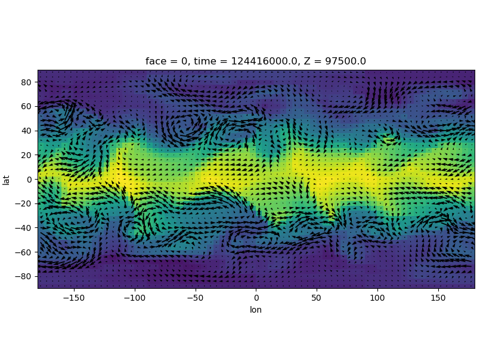
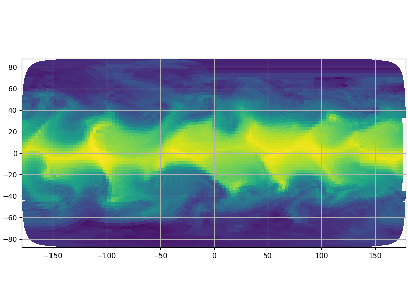
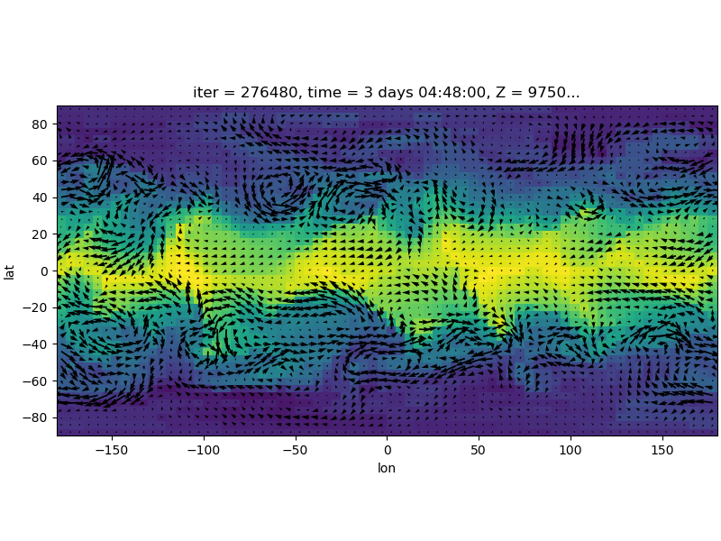
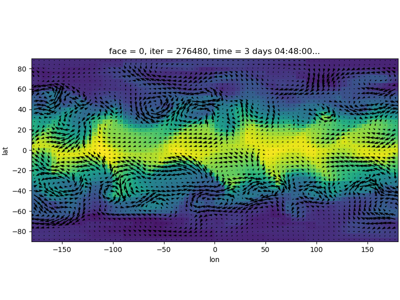

# Examples
See `examples/example.py`. The following plots have been created using data from `tutorial_held_suarez_cs`.
```python
import matplotlib.pyplot as plt
import cubedsphere as cs
import cubedsphere.const as c

# Specify directory where the output files can be found
outdir = "/Volumes/SCRATCH/sim_output/xmitgcm_test/nc_test"

# open Dataset
ds = cs.open_mnc_dataset(outdir, 276480)

# regrid dataset
regridder = cs.Regridder(ds, 5, 4, reuse_weights=False, filename="weights", concat_mode=False)
# Note: once weights were created, we can also reuse files by using reuse_weights=True (saves time).
ds_reg = regridder.regrid()
```
Only takes few seconds!
```python
# do some basic plotting to demonstrate the dataset
# determine which timestep and Z to use:
isel_dict = {c.time:0, c.Z:0}

# do some basic plotting to demonstrate the dataset
fig = plt.figure(figsize=(8,6), constrained_layout=True)
ds_reg[c.T].isel(**isel_dict).plot(vmin=260,vmax=312, add_colorbar=False)
U, V = ds_reg["U"].isel(**isel_dict).values, ds_reg["V"].isel(**isel_dict).values
cs.overplot_wind(ds_reg, U, V)
plt.gca().set_aspect('equal')
plt.savefig("../docs/images/temp_reg.png")
plt.show()

```

```python
# Now also plotting theta without regridding (on the original grid):
fig = plt.figure(figsize=(8,6), constrained_layout=True)
cs.plotCS(ds[c.T].isel(**isel_dict), ds, mask_size=5, vmin=260, vmax=312)
plt.gca().set_aspect('equal')
plt.savefig("../docs/temp_direct.png")
plt.show()
```


## Tests with xmitgcm:
See `examples/example_xmitgcm.py`

Since we do not have the grid information, we need to fallback to the `nearest_s2d` interpolation with concat mode. Concat mode means that instead of regridding each face individually and summing up the results, we first concatenate the ds along the X dimension and regrid on the flattened dataset afterwards.



We can fix this and keep using `conservative regridding` by using the grid files from the mnc dataset:



In the future we will use `xmitgcm.utils.get_grid_from_input` function instead.


